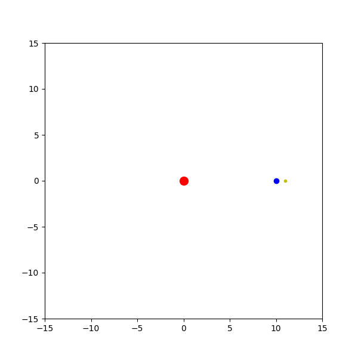

# VirtualPlayground
A curated collection of educational and experimental code examples in Artificial Intelligence and Simulation.
This repository serves as a playground for learning, prototyping, and exploring creative ideas in computational intelligence.
## 🌞 Sun–Earth–Moon Simulation


---

## Features
Clean, minimal, and well-structured Python scripts
Covers both AI algorithms and simulation techniques
Easy to run, extend, and integrate into your own projects

---

## Repository Structure
- `Introduction/` : Introductory Python examples
- `MonteCarlo/` : Monte Carlo methods and random sampling
- `Optimization/` : Function fitting, Traveling Salesman Problem etc.
- `Bio/` : Ants, Birds, Virus etc.
- `Physics/` : Planets, Pendulums, Tunnleling effect etc.
- `Society/` : Inventory management, Trade simulation, Maze etc.
- `ImageCompression_Classification/` : Using neural network and tensor network

---

## Getting Started
Clone this repository and try the examples:

```
git clone https://github.com/your-username/VirtualPlayground.git
cd VirtualPlayground
python Introduction/plot.py
```

---

## Purpose

This project is not a production-ready library —
it’s a sandbox for experiments and creative exploration in AI and simulation.
The goal is to make learning complex ideas approachable, visual, and fun.

---

## Contributing

Contributions, suggestions, and ideas are always welcome!
Feel free to open an issue or submit a pull request.

